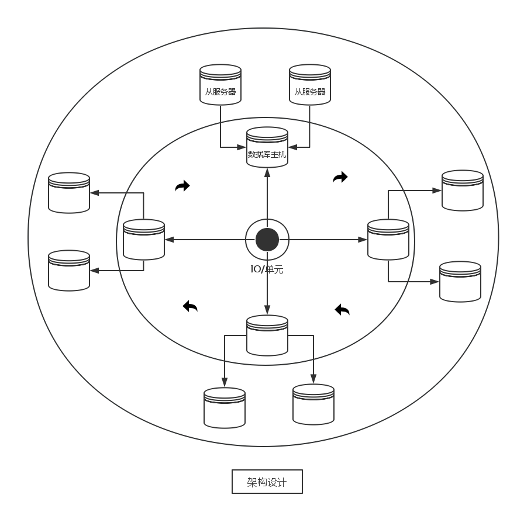

##全局架构设计

###主题：速度 与 容量

###全局逻辑模型

我们的核心是容量与速度，一致性哈希帮我们解决了数据一致性问题，甚至帮我们也解决了扩容的问题，然而也确实如此。所以我们需要解决速度的问题了。

####速度影响因素分析：
    
        初级阶段提供的访问策略：
            客户端通过API直接访问我们的数据库集群。
        优点：@速度极快，直接访问到了我们的数据库。
             @对于非结构化数据，访问速度提高明显。
             @操作简单，逻辑简单
        缺点：#安全性低，直接访问到了我们最底层的存储结构。
             #重复访问概率大大增加，不必要的连接请求增多。
             #如果运气不好遇到热点数据，环上的节点直接过载。
             
        中级阶段提供的访问策略：
            客户端首先访问代理服务器，代理服务器访问数据库集群。
        优点：@安全性大大提高。
             @服务器集群压力进一步缩小。
             @代理服务器可以采用机器学习算法，缓存热点数据，销减大量重复请求。
        缺点：#速度在初期会因为机器学习相关算法而将低，后期在理想情况下也会低于初级阶段速度。
             #

        解决方案：
             *整个集群提前上线，伴随运行，等待算法体系完善。
             *初期采用多台代理服务器，缓解访问压力，即（机器 换取 时间）。中级阶段后期可撤换主机。
             *采用更加适合这个场景的算法。
             
        高级阶段提供访问策略：
             *期望未来可以设计出更高效的方法*
###服务器集群模型

###三层环形模型

依据一致性哈希分布方式，我们采取三层环形方式，组织我们的整个架构。

第一层：

   如上图所示，最内层的环形结构，是由IO单元服务器组成，这一层的服务器较少，主要负责处理外部的连接请求，读写请求。
   
第二层：

    接着是我们的中间的一层环形结构，这一层就是我们的一致性哈希环的分布式部署实例，可以说我们
    的整个架构都是基于一致性哈希环的，所以整体的表现必将反映核心思想，所以是以环形结构为基础
    的架构设计。
    
第三层：

    我们是数据库服务器，所以必将是备机作为第三层环形结构。负责数据库服务器的数据实时备份。

###设计思想阐述

作为一种底层通用的软件，我们在设计的时候，当然不能只着眼于业务需求，局部性固然是需要考虑的
我们也应当为这款软件的未来所考虑，我们需要它能发展下去，它的生命力本身也应当是很长的，总有点“十年磨一剑”的意味，为了做到如此，我们采用UNIX的一个核心思想，只提供机制，尽量不要提供策略，这也正是UNIX 历经各种变化而存在的核心原因。

所以在这个项目中，我们也力求提供基础的操作API，至于策略就根据具体的使用场景而定了。