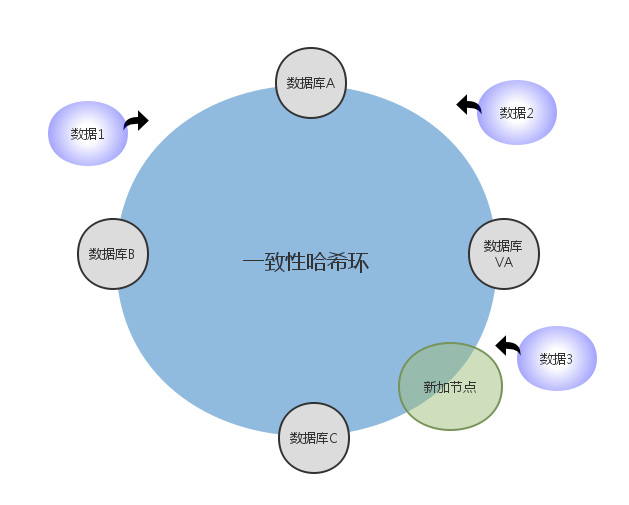
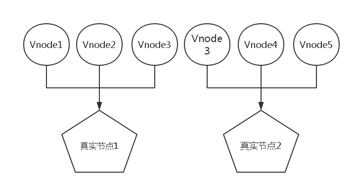

#分布式系统框架设计

##设计目的
    数据库服务器经常会因为“过热”的原因导致数据库服务器，无法提供服务，所以我们需要解决这个
    “热点“问题，而使用分布式结构可以很好的缓解这个问题，但是我们希望能够解决这个问题，而分布
    式有很多不同的结构，适用于不同目的，我们这里选用一致性哈希(consist hashing)来完全解决
    这个问题.
    
##设计理论

    通过一致性哈希我们可以比较均匀的散列数据，一致性哈希最早在1997年被MIT的论文《 Consistent 
    Hashing and Random Trees》中被提到，这个系统也引用了这篇论文的思想，我们还大致翻译了
    这篇论文，集合Redis集群的思想， 我们的整个架构应运而生。
    
##架构设计

整个空间是一个我们已经定义的一个区间例如0 ~ 2^32-1,这是一个比较大的空间了，如图所示，我们可以将数据库实例A，B，C加入这个环中，我们假设每一个节点是一个桶适用B 来表示，数据适用i来表示，则存在哈希函数族函数F(i,B).会有一族函数来散列。防止被发现哈希函数规律，导致被恶意攻击，然后我们还可以看到虚拟节点VA。后边会介绍虚拟节点。

每次有请求进入哈希环后，经过哈希运算，得出一个在这个哈希环中的位置，如果这个位置没有对应节点则顺时针走向，找到第一个遇到的节点。

##一致性哈希函数

##虚拟节点的应用

上边提到了虚拟节点的概念，当我们的虚拟节点很少的时候，极有可能出现负载不均衡的情况，可能发生几个节点负载不均衡的情况出现，所以我们需要使用一些虚拟节点，很多虚拟节点映射实际存在的节点，就能在很大程度上实现负载均衡。

##增删节点

如图所示，当有一个节点被增加，则必然导致数据库C 和 VA之间的数据不命中，我们必须迁移数据库C中新增节点位置到VA 的数据到新增节点中去，这是不可避免的情况，但是通过一致性哈希的方式我们已经将普通哈希的冲突问题尽可能的缩小了，这样的结果我们时可以接受的，一个节点的改变只影响最多它的上一个或者下一个节点的变化，更何况我们每一个数据库其实还是一个主从模型，很难导致一个数据库下线而不能会来的情况出现。
 
##引用论文

《Consistent hashing and random trees》 1997 MIT
 
 http://dl.acm.org/citation.cfm?id=258660