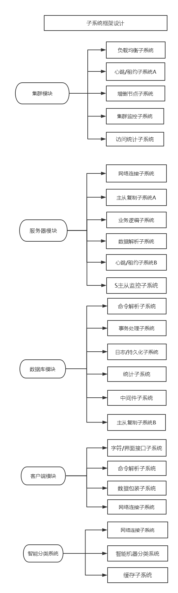

ss
##各个子系统设计

##子系统设计框架

以上是所有模块于各个子系统的结构，下面逐个简述其功能

###集群模块

####负载均衡子系统

我们使用了一致性哈希做为整个集群的结构，虽然可以使用一致性哈希函数将数据做随机散列，但是我们也应该考虑到不同数据库的负载情况，这其中我们还会有虚拟节点做为辅助，在数据的散列上我们其实不需要做太多的工作了，但是我们必须监控每一个环上的子节点，包括它的CPU，MEM，负载等指标，当出现异常的时候我们需要记录然后将问题信息反馈给数据库管理员。

####心跳/租约子系统
作为一个集群我们应该也是必须考虑每一个节点和主控节点沟通的问题，我们采用两种方式来保持主控节点和各个节点之间是沟通良好的，主控节点给普通节点发放租约，简单来说，就是每间隔一定的时间主控节点给普通节点发放一个权限，在这个契约的时间，普通节点提供正常服务。
第二种方式就是心跳形式，每个普通节点每间隔一个相对较小的时间给主控节点发送一个消息，目的就是报告自己的情况和自己还在线，如果普通节点出现主从替换，那么也是需要报告的。

####增上节点子系统

当这个环上需要增建或者删除节点的时候，我们需要使用这个子系统，每当需要增加或者删除节点的时候，这个节点就会发挥作用。这个结构维护一张全局的路由表以及每个节点的相关信息。

####网络连接子系统
负责P2P的连接，和客户端之间的连接，仅仅只做分类哈希运算。

####集群监控子系统
负责监控全部集群的所有的服务器，负责多租户分离。
####访问统计子系统
统计时段访问量，负责统计各项指标信息。

###服务器模块

####网络连接子系统
就是网络库，负责连接主控节点，等待派过来的事务。
####主从复制子系统A
负责主从复制的半部，就是发送动作。
####业务逻辑子系统
包括任务队列，线程池，定时器等，暂时把核心支持代码放在这里。
####数据解析子系统
根据发送过来的数据包，解析出相应格式的数据，即是合并数据包。
####心跳租约子系统B
向主控节点发送消息。
####S监控子系统
我们的每一个普通节点都是一个主从复制模型，这个模型由两个从服务器和一个主服务器族组成，吸收了Redis 的监控系统。
###数据库模块

####命令解析子系统
当服务器接受到了信息后，数据库模块开始接手，首先就是解析接收来的数据。
####事务处理子系统
当解析出了相应命令以后，我们使用数据库的接口，将数据组织起来。
####日志持久化子系统
作为数据库我们需要将每一条记录的操作记录到日志文件中。
####中间件子系统
缓存数据库总是存在在内存中的，我们需要使用一些持久化的数据库作为底层存储，也页一说是和Redis + MySQL  是一个道理。但是我们需要建立一个中间件子系统。
####主从复制子系统B
主从复制的另一半，即从数据库中抽取出数据。
###客户端模块
####字符/界面接口子系统
提供统一接口，以后不论是字符界面还是QT的界面，我们直接可以使用，实现简单的分层。
####命令解析模块
用户从命令行，或者从API输入指令，我们需要解析，并且初步组织成一个数据结构。
####数据包装子系统
把从用户得到的数据按照已经定义好的格式，做成数据包。
####网络连接子系统
发送我们的数据到服务器上。
###智能分类模块
####网络连接子系统
负责客户端和集群的桥接
####智能机器分类系统
根据机器学习的SVM算法和决策树，分类信息，预测可能热点信息
####缓存子系统
当我们预测除了可能的信息后，缓存起来，当有请求来临时我们可以完全先访问缓存。
根除热点数据问题。