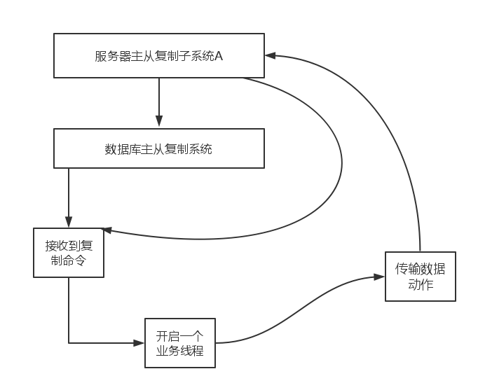

##数据库模块_主从复制子系统B

##概述

    在服务器模块中，我们已经比较详细的分析了主从复制子系统的第一个部分，就是数据的传输部分。
    接着我们来讨论主从复制子系统B--数据库系统。
    
##设计模型

    主从复制子系统B
    
    

主从复制子系统B主要是做以下的一些工作：

当服务器接收到一个主从复制类的命令，会完成以下的一些动作。

step1:  开始内存快照

step2:  开启一个业务线程

step3:  向对方统一快照
  
step4:  开始发送数据 
