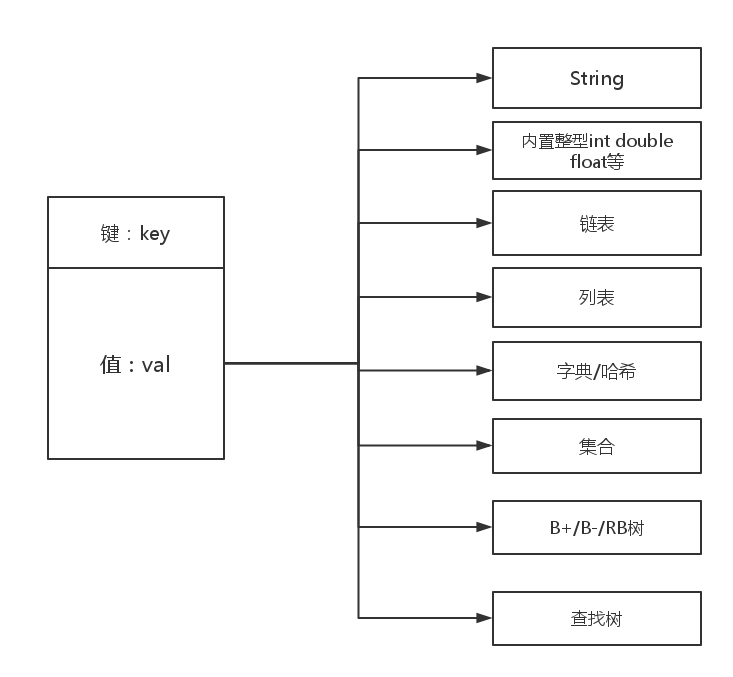

##数据库模块_事务处理子系统

##概要

在这里我们就要开始考虑设计的细节了。

首先这是我们之前已经设计好的数据库模型。


首先我们从底层开始考虑

####键值对

key-val 键值对是我们的存储模型最小的存储单元。就是最底层的存储数据结构。

我们使用了这样的设计结构。



key 是固定的存储类型，字符串型。

val 作为存储的值，我们需要使用多种数据结构来存储。

设计中我们需要这几个数据结构：
String ； 内置类型 ； 链表 ； 列表 ； 字典/哈希 ； 集合 ； BT树 ； 查找树 ；

###数据库设计

####数据库实体
 
首先，一个数据库实体应当具有如下信息：

以下是伪代码

```
class FDB{

    DB[15];            /*首先应当具有数据库实例的16个小数据库实例*/
    int DB_num;        /*已用数据库实例个数*/
    int c_ser;         /*从服务器个数*/
    int acctive[3];    /*从服务器状态*/
    struct time up;    /*上线时间*/
    struct time last_done;    /*最后一次服务器宕机时间*/
    float  CPU  ;       /*cpu 使用率*/
    float  MEM  ;       /*MEM  内存使用率*/
    flaot  load ;       /*整个服务器的负载*/
    int    key_val_num;    /*数据库服务器存储的键值对个数*/
    
    int fun_getnum();  /*返回各个DB实例的总键值对个数*/
    int fun_addelem();  /*增加一个键值对到相应的DB数据库中*/
    int fun_delelm();   /*删除一个键值对到相应的DB数据库中*/
    int fun_exitelem();  /*判断一个数据库中的键是否存在*/
    int fun_getvalelem(); /*返回一个给定键的值*/
    int fun_sort();       /*排序相关*/
    int create_hash();    /*获得哈希值，这个哈希值最终会贯穿全局*/

};

```

####DB数据库实体

```
class DB{

    Table table[4];      /*假设这里只有4张表，每一个表存有数据的索引*/
    Table re_table[4];   /*用于重新散列之用*/
    
    int mask ;           /*掩码，其实就是表的个数*/
    int key_val_num;      /*每张表的存储数据规模*/
    int load       ;     /*负载因子*/
    
    
    int fun_getnum();  /*返回各个表实例的总键值对个数*/
    int fun_addelem();  /*增加一个键值对到相应的表中*/
    int fun_delelm();   /*删除一个键值对到相应的表中*/
    int fun_exitelem();  /*判断一个表数据库中的键是否存在*/
    int fun_getvalelem(); /*返回一个给定键的值*/
    int fun_sort();       /*排序相关*/
   
    

};

```

####索引实体结构

索引就是我们这个哈希表中存储数据的链表，我们采用的是开放性散列，所以直接可以放在我们的
表的后边。
伪代码：

```
class table {

   Index index[4]   ;    /*数据对象的链表*/
   int key_num       ;    /*所有链表上的元素个数*/
   int mask          ;     /*掩码，这个其实可以指定我们修改链表的数量*/
   int key_num[4]]   ;    /*每条链表上的元素个数*/
   int load          ;    /*负载均衡*/
   
   int fun_getnum();  /*返回各个索引实例的总键值对个数*/
   int fun_addelem();  /*增加一个键值对到相应的索引中*/
   int fun_delelm();   /*删除一个键值对到相应的索引中*/
   int fun_exitelem();  /*判断一个表数据库中的键是否存在*/
   int fun_getvalelem(); /*返回一个给定键的值*/
   int fun_sort();       /*排序相关*/


};


```

####数据链表结构

最基础的键值对以上就是链表结构了。

```
class Index{

    key_val  *head;   /*链表的头*/
    key_val  *tail;   /*链表的尾*/
    int sum       ;   /*链表中元素的个数*/
    key_val * itor;   /*链表迭代器*/
    
    int fun_add();
    int fun_elem();
    int fun_del();
    int fun_exit();
    int fun_settime();
    int fun_gettime();
    int fun_find();
    
};


```


####键值对结构

键值对使我们数据库最小的存储单元

```
class key_val{

    string key;   /*键*/
    void * void;  /*值*/
    int type;     /*值的类型*/
    int mark;     /*编码规则*/
    struct time create;  /*创建时间*/
    struct time exit;    /*存在时间*/
    
    int get_val();
    int get_key();
    int get_type();
    int get_time();
    
    int set_val();
    int set_key();
    int set_type();
    int set_time();
    
};

```


