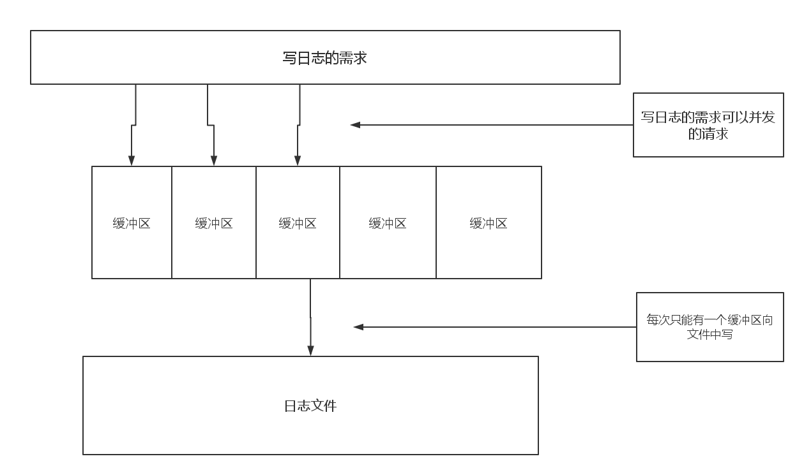

##数据库模块_日志持久化子系统

###日志模块的设计
我是在为我的数据库写这个日志模块所以我需要考虑如下几个指标：

1.并发量还是很巨大。但是多个线程同时需要写日志这种可能性还是有的，一个连接给一个线程池中的线程干活，当业务很多的时候，好几个线程同时需要写日志是很可能的，所以需要来考虑。

2.吞吐量这个指标对于一个日志自系统来说都是很重要的，我们当然需要尽量利用硬盘的读写速度。

###设计模式

思路：
开辟几个缓冲区，每个缓冲区均有自己的锁，然后需要写日志的时候，就获取其中的一个锁，写入缓冲区，如果一个线程发现自己写完日志后，正好这个缓冲区满了，那么它就要负责去抢文件的锁，将整个缓冲区全写进文件里去。

其实这就是分治的思想，在glibc中大量使用了这种思想。


###设计模型



###AOF 
###AOF持久化功能
正如Redis 中的那样，AOF是记录每一条操作的，这样当数据库停机后，可以恢复数据。

当然我们需要偏考虑到数据的兼容与更新，所以在设计的时候需要谨慎。


####设计格式

AAA/XXX/DDD/CCC/FFFFF

####AOF功能
记录每一条操作以及数据，为了恢复数据而存在。

###RDB
####设计格式

GGG/HHH/FFF/BBB/CCCCC

###RDB持久化功能
这个是支持SAVE 命令的存在，我们需要再一个时刻保存所有的内存中数据，所以需要扫描内存保存所有的数据。

###功能简要伪代码


```

class  write_fd{

    int fd[3];   /*写的目标文件*/
    int level;   /*三个日志级别*/
    
};

```

```
class Buf{

    buf[MAXSIZE];   /*一个缓冲区实例*/
    int SIZE;     
    mutex;          /*一个缓冲区的锁*/
    
    log_write();        /*写文件*/
    log_add();          /*添加一条记录*/
    log_return();       /*返回一些信息*/
    
};

```

```
class log{
    
    Buf[maxsize]; 
    int size;
    
    log_add(AOF/RDB); /*写日志*/
};

```


  


