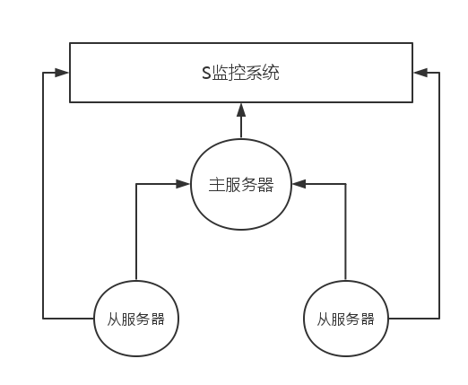

##服务器模块_S主从监控子系统

###S主从监控子系统概述

    现在我们考虑的是每一个数据库服务器的实例设计，每一个集群节点就是我们的一个主从模型。
    


###S监控子系统

    监控子系统有以下职能：
        @监控主从节点各项指标是否正常。
        @当有节点因故下线，我们需要及时反馈。
        @主节点下线，及时选出主控节点，提供服务。
        @节点的添加与删除工作。
        
        
###主要工作逻辑

    当一个主节点下线因故下线，在从属服务器中挑选一个负载较少的服务器作为主服务器上线。
    当因故下线的服务器重新上线后，将重新上线的服务器加入主从模型。

###实现策略

    还是采用心跳的策略保证主从模型能够被监控系统所侦测。
    
    
###逻辑伪代码

```
class s_ser{

        ser_master  master ;     /*主控节点*/
        ser_s       s-ser1 ;     /*从属服务器节点1*/
        ser_s       s-ser2 ;     /*从属服务器节点2*/
        int         ser_num;     /*在线个数*/
        
        base_info   ser_s[3];    /*s三个服务器的基础信息*/
        .....
        fun_load();              /*负载测试函数*/
        fun_up();                /*权限提升，选主*/
        fun_down();              /*下线通知*/
        .....

};

```