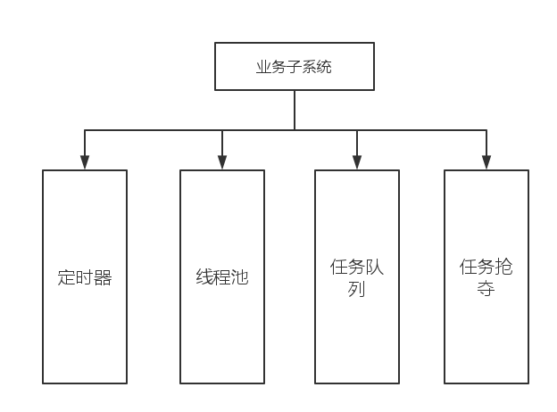

##服务器模块_业务逻辑子系统

##概述

    在服务器模块的业务逻辑子系统中，我们将在这里整合一些核心的业务代码，这里很少关乎也无逻辑
    但是和整体性能有很大的关系，为了防止第一次设计导致后边难以更改，所以这里暂时只定义接口和设计，不提供具体设计实现，这里是需要在最开始的时候思考性能的地方。
    
    在这个子系统中，每一个最小调度单元应该是任务。
    
##设计

##线程池

/*文档待补*/

##定时器

####定时器首先使用的场景分析：

使用场景：

        1.第一种定时情景是面向全局下的周期性事件。
        
            对于全局的强定时事件，我们使用一个全局的时间事件FD，注册到epoll 
            对于全局的弱定时事件，我们同样注册一个全局的FD，到epoll 中，当一定事件过后直接触发 FD我们这个时候就可以遍历一遍我们的事件轮或者事件链表。
             
        
        2.第二种情景时面对局部的动作延时测定。
            
            初步使用timerfd,因为着这种事件比较多，所以我们需要考虑到底使用哪一种定时机制。
            
        
        
####定时器设计

定时器分为两个部分：

第一个部分是：

    需要周期执行的定时器，使用时间轮或者时间链表。着两个结构都是全局的。
    
    延时控制类定时器都是希望在局部实现一个定时器。
    
    

