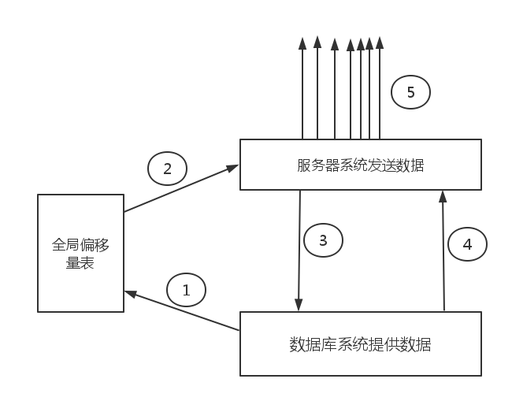

##服务器模块_主从复制子系统A

##概述

主从复制子系统，由两个部分组成。

A部分：由服务器负责，主要进行传输工作。
B部分：由数据库负责，进行数据提交。

##实现机制

由数据库系统提交数据，接着由服务器发送，我们将数据组织和数据发送分割成两个部分，希望在以后的优化中简化性能瓶颈地分析，然后逐步提高。

##设计模型A

主从复制主要以下的步骤。

step 1: 数据库系统自拍快照，映射全局偏移量表。

step 2: 服务器系统读取全局偏移量表。

step 3: 服务器根据偏移量表信息，向数据库系统索要数据。

step 4: 复制开始

SP1： 当传送过程中，主从因为各种原因掉线。

SLO:  主从将数据表直接写入文件，持久化，待网络恢复从断线处重新连接。

