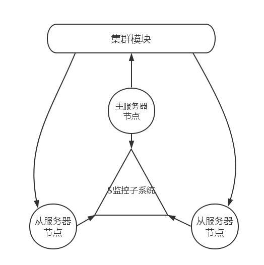

##服务器模块_心跳租约子系统

##概述

        我们这里讨论的服务器心跳租约子系统是指两个方面。
        主节点向集群模块发送心跳。
        从属服务器向S监控系统发送心跳。
        
        
##主节点向集群模块发送心跳

前提：
        
        主从总共三个服务器都在不同的机器上，S监控系统在主控节点的机器上以一个独立的进程存在。

上图展示了我们整个关于监控系统的所有信息。

首先在最上边一层的是集群模块的监控子系统，它负责协调整个集群的服务器工作。它的核心动作都是围绕着一个全局路由表来运转的。当一个主控节点真的因为意外事故下线了，当次尝试多次联系无果后直接由集群模块联系从属服务器节点。

接着第二层是主服务器节点，主控节点负责业务的同时也需要向S监控子系统发送数据并且向集群模块发送心跳包。

然后最后一层是S监控子系统和从属服务器的组合，S监控子系统负责协调每一个节点组合正常工作。

