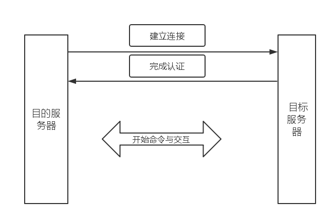
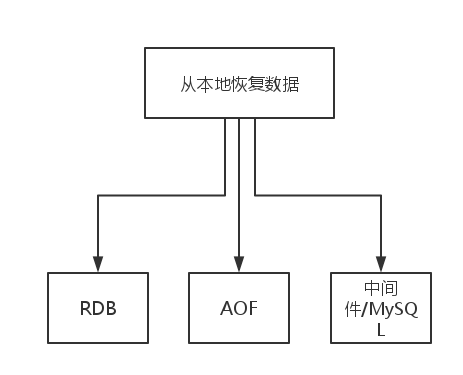

##服务器模块_数据恢复子系统

###概述

    对于一个集群/单机节点而言，我们有以下的几个使用场景：
    @作为集群节点因为上线需要获得数据
    @作为从属节点上线需要获得数据
    @节点因为宕机重启需要从本地持久化数据加载数据
    
    
###关于这几种情况的讨论

####1.作为集群节点上线需要获得数据
    集群节点因为其中的一个节点需要分散或者加载数据，而被动被影响，直接以常规数据存储处理。
####2.作为从属节点上线需要获取数据
    

这一部分我们会在数据迁移子系统中详细描述。

####3.节点因为宕机需要加载本地持久化数据

如上图，我们需要从本地恢复数据，我们可以采用以下的一些方式。

RDB RDB记录的是当时内存中的数据，直接进行键值对的恢复。

AOF AOF记录的是某一个时间段内的所有操作，根据这些操作重新构建数据库数据。

中间件/脚本  从一些已经持久化的数据库中提取数据，或者从用户的脚本中读取数据。

