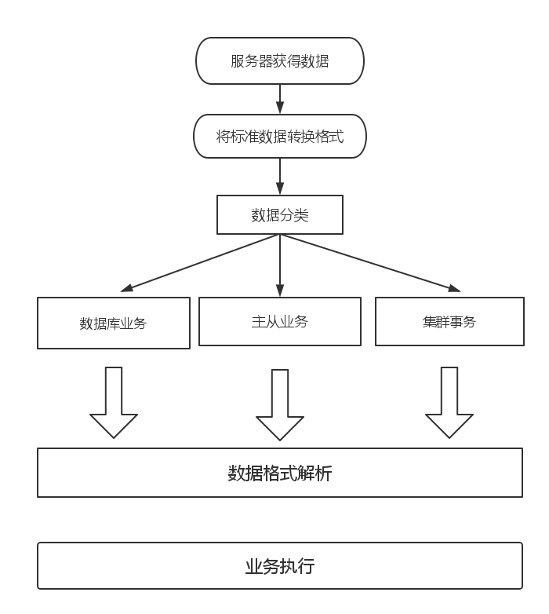

##服务器模块_数据解析子系统

##概述

    当服务器接收到数据之后就是处理数据了，其实服务器只是数据的搬运工，数据库服务器核心自然是
    业务处理。
    
##数据解析流程



上图就是我们数据解析流程的设计，做如下解释：

流程：

    step 1: 通过服务器获得数据。
    step 2: 将我们使用的一些现有的标准格式数据转换成我们指定的协议格式
    step 3: 对数据进行分类。
    step 4: 使用每一种数据解析器进行解析。
    step 5: 执行相关任务。
    
    
###几种命令解析器

1.数据库命令解析器

    这个解析器的主要工作就是解析各种数据库的操作，例如匹配命令，数据解析等操作。
    由其这里我们需要设计一个O（1）的算法。
    
2.主从命令解析器

    解析主从相关命令。
    
3.集群命令解析器

    解析集群相关命令。
    
###匹配算法
```
/*待开发*/
```