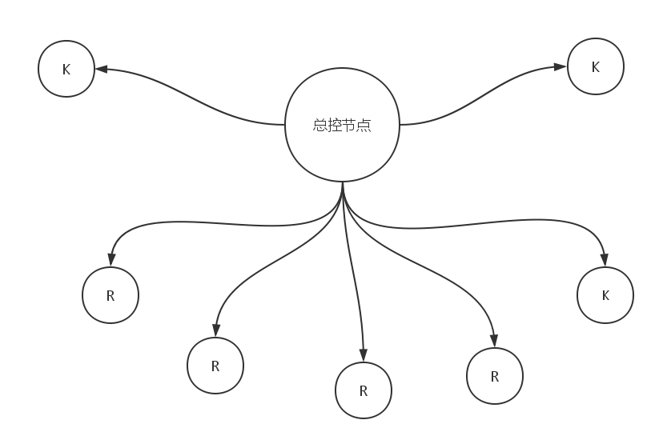
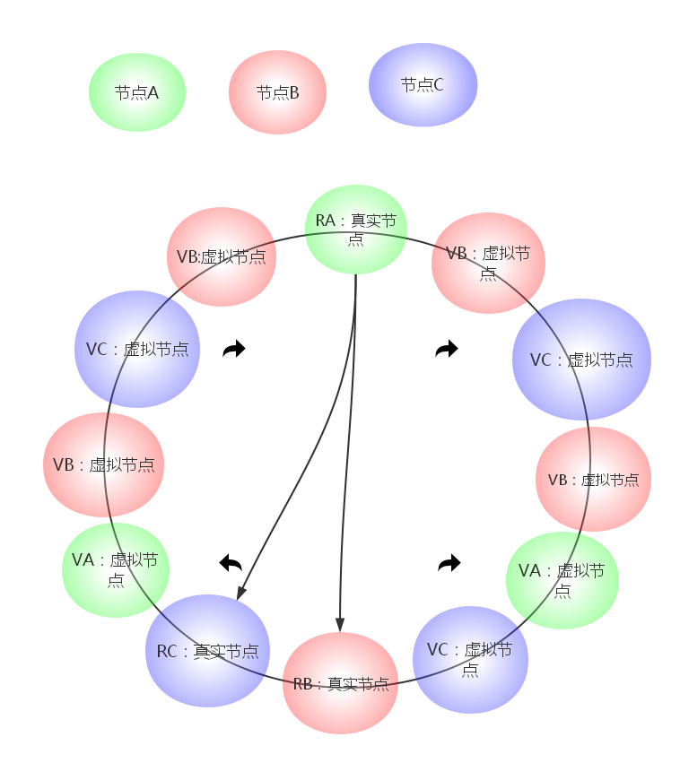

##集群模块_增删节点子系统

###模式构成



增删虚拟节点或者真实节点都是由总控节点来完成的动作。
总控节点负责维护一个全局的路由表，包含所有的虚拟节点与相对应真实节点主从模型的映射关系。


####各个节点视角

对于每一个节点应当保存它的前一个和后一个节点的路由信息。

```
class net_neb{

     net_mesg  prev;   /*保存前一个真实节点数据*/
     net_mesg  next;   /*保存下一个真实节点数据*/
     
     int flag[2]   ;   /*前后服务器的状态*/
     
     ........
     
     fun_ping();        /*连接*/
     fun_copy_data();   /*数据迁移*/
     ........
     
};


```


###全局路由表伪代码

```
class net_traval{

    set  real_node;       /*真实节点集合*/
    set  vir_node;        /*虚拟节点集合*/

    ........
    real_node fun_get(hash);      /*根据哈希结果获得在哪一个节点上*？
    real_node fun_get(vir_node);
    vir_node  fun_get(hash);
    ........
    
    
};

```

###增加一个节点

当我们需要增加一个节点的时候我们不但要增加真实节点还需要增加虚拟节点。

增加一个真实节点的步骤：

1.总控节点沟通需要添加的目标节点，确定添加的目标节点是稳定可用的。

2.按照比例确定这个真实节点需要配套几套虚拟节点。

3.通过散列服务器的IP获取每个节点的hash值

4.确定每一个哈希值可用，和路由表中的数据对比，虽然冲突的概率很小。

5.将所有的节点加入进我们的哈希环结构。

6.测试节点可用。

>说明：因为我们增加了节点的数目，所以我们需要数据迁移，由于我们使用了一致性哈希，所以我们的迁移工作也不是很大，在这个一致性哈希环上，我们可以发现其实一个新的节点影响的只是他到下一个节点的范围的数据，所以直接把这个范围的数据迁移过来就OK，当然包括虚拟节点的下一个节点，毕竟虚拟节点除了不存数据和真实节点是完全等价的关系，这从侧面也反映了对于这个系统来说，越多的节点，对于这个系统来说越有利。


这就可以开始正常工作了。

###删除一个节点

当我们需要删除一个节点的时候，删除和添加互为逆过程，但是删除的逻辑看上去比较简单，当删除一个节点后，我们需要把关于这个节点所有数据都迁移到它的下一个节点中。

###逻辑伪代码


```
class net_travl{

    /*接上边的类*/
    serve  obj[];       /*复制的目标服务器们*/
    serve  ato;         /*复制的源服务器*/
    ......
    fun_copy(ato,obj[]); /*数据散列迁移函数*/
    ......

   
};

```
如果你没有看清数据迁移方式，我这里有一个比较全面的图。

###数据迁移状态转移图示




这是我们的一致性哈希环，环上有三个数据库服务器实例A,B,C.分别使用绿，红，蓝表示。

其中：
 
    V*代表虚拟节点。
    R*代表真实节点。
    顺时针散列数据。
    
    当我们的数据库服务器A节点下线时，我们需要迁移服务器A的数据，从图中我们可以看到，不止仅仅
    迁移A真实节点，为了数据的一致性它的虚拟节点也需要迁移。所以根据图我们得出以下迁移步骤。
    
    1.A的真实节点的下一个节点是VB ，则我们的数据必须迁移到B节点。
    2.A的虚拟节点的下一个节点还有C的虚拟节点，所以我们必须把相应的数据迁移到C节点中去。
    
PS：
    简单起见，也可不考虑虚拟节点。


