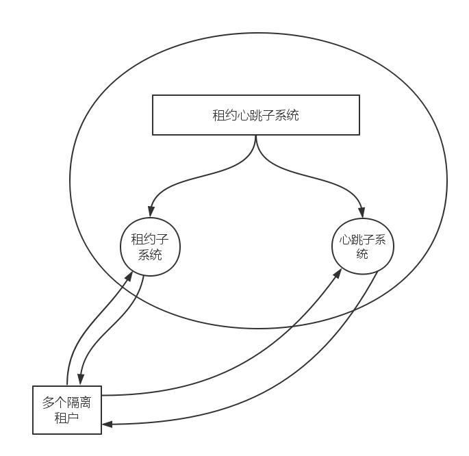

##集群模块_租约心跳子系统


###涉及结构




这个子系统由两个部分构成，一个是租约系统，一个是心跳系统。

租约系统：
      
      总控节每间隔一个较长的时间可以给相应的提供服务的数据库服务器一个持续工作的时间，在这个
      租约的预期时间内，各个租户就可以持续的提供自己的服务，当租约时间将要耗尽，则需要再次请求。
      
心跳子系统：

       各个租户在一个较短的时间内给总控节点发送自己的相关信息，告诉总控节点自己是在线的。当
       超过某一个时间后，我们就可以判端这个租户在租约时间内可能发生了问题。会重复间隔时间多
       次发送应答消息，直到收到回应，或者在一定尝试次数之后直接判断这个租户下线。
       

####逻辑伪代码

```
class lease{

     thread_t   one_of_threadpool;    /*需要一个线程实例*/
     ceate_time fd;                   /*定时器*/
     fun_send_lease(net_table,mesg);  /*根据全局路由表发送租约*/
     fun_returnack() ;                /*确保收到消息*/
};

```

```
class heart{
    thread_t   one_of_threadpool; 
    crate_time_fd;
    get();         /*接收消息*/


};

```

