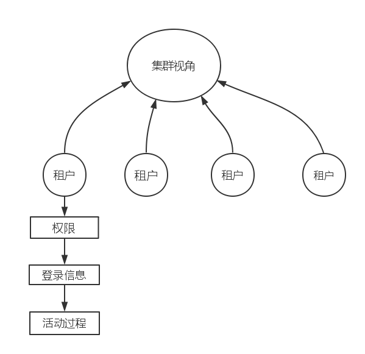
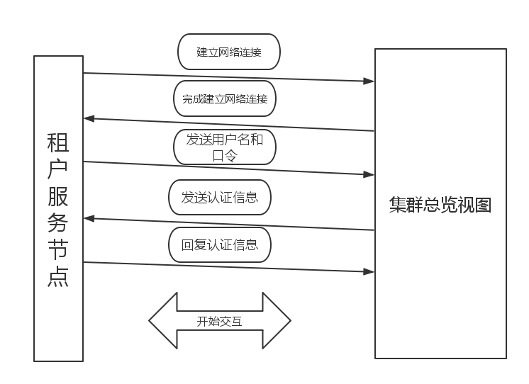

##集群模块_访问统计子系统


###租户权限访问子系统与审计子系统概述

对于整个集群而言，我们也需要用户登录，每一个用户就是一个集群的用户。

既然有了用户我们就需要考虑安全的因素，这不但是开发人员需要考虑的，更是软件未来运维的主要管理工作。所以我们需要组件这个子系统，抽象出每个用户的信息，登录信息，用户授权，操作日志，访问次数IP，信息以主要以日志的形式保存下来。


###集群中的租户模型



我们首先建立一个模型。

如上图，在集群模块看来，他的租户就是他的用户，那么他就需要管理他的用户的行为。

我们需要考虑以下的一些问题：

安全性：

        安全性是我们必须考虑的一个问题，如果一个数据库不安全，那将是一个致命的问题。
        在这里我们考虑的安全性的问题主要在于用户安全，我们不仅需要保证登录用户的数据
        安全我们还必须保证集群安全，不能被其中的恶意用户捣乱整个集群。所以安全的登录
        协议是很重要的。

清晰性：
        安全固然重要，但是整个从认证到授权的流程也是非常重要的，我们保证安全不应该建
        立在极度复杂和冗余的认证过程上。
        

约束完整性：

        所有租户即使由不同的权限不同的安全级别，我们也必须有一个清晰的逻辑，应当按照
        租户类型操作权限，合理建立权限等级管理方案。
        
        
####认证逻辑流程



上图就是我们的认证流程

第一步： 用户请求建立网络连接

第二步： 集群回复完成建立网络连接

第三步： 用户发送口令 

第四步： 发送认证信息，可能是一个加密后的口令

第五步： 回复解迷口令

第六步： 完成正常的交互信息


####逻辑伪代码

```
class user_tenant{           /*总控节点看到的各个节点登录信息*/

        char *usr_name;   /*租户名称*/
        char *IP;         /*租户IP*/
        int  port;        /*租户端口*/
        long long hash;   /*租户哈希*/
        int step_flag;    /*租户认证阶段*/
        int power  ;      /*用户权限等级*/
        int curr_power;   /*用户当前等级*/
        ......
        fun_connect();    /*认证函数*/
        fun_step1();      /*认证过程*/
        fun_step2();  
        fun_step3();
        fun_step4();
        fun_step5();      
        
        log_login();      /*登录日志*/
        ......

};

```

```
class dynamic_passwd{

       /*这是一个产生动态口令的类*/


};

```


