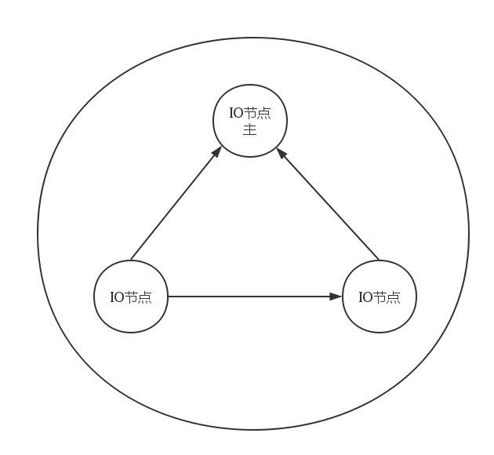

##集群模块_请求处理子系统

###集群模块_请求处理子系统概述

        集群模块作为整个集群的门户，也是三层环型结构的最上边一层，集群模块不但需要处理监控和
        节点的负载均衡，而且更重要的是负责分类集群所有数据对象的去向。负载均衡问题我们已经
        通过一致性哈希自带的属性解决了问题。但是我们依然需要处理请求的问题。这里作为我们三层
        模型的第一层，我们需要详细考虑这个模型。
        
###集群主控层---三层环形结构第一层




这是第一层的环形结构，由多台IO服务器联合组织的一个环形结构。负责处理集群的IO请求分发。

结构构成：

        一个主控节点和两个从属控制节点。除了主控节点需要做一些琐碎的事情外，其它所有的结构
        都是一样的。
        
选举协议：

     顺序选择第一个节点，各个服务器将自己的负载标称值发送到默认第一个服务器中去，然后比较
     比较几个值，选取当下负载最小的一个为主控节点。
     
###伪代码

```
class  IO_server{

        char *IP;
        int  port;
        int load ;
        double cpu  ;
        double MEM  ;
        
        ........
        fun_getload();
        fun_hash();
        fun_do()  ;
        fun_link_as();
        ........


};

```

     