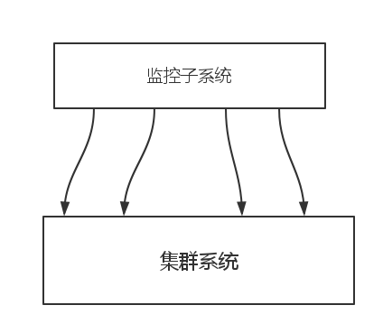

##集群模块_集群监控子系统

###监控系统概述

        作为一个集群，自然需要一个监控系统，这个监控系统主要是监控集群，服务，任务，资源管理
        等。通过收集信息，运算处理信息，将信息转化成操作实例，然后行为做出影响，广泛的
        见于负载均衡，资源管理，任务调度等方面。
        但是，我们的这个集群应用了一致性哈希，其实已经解决了负载均衡的问题，由其是虚拟节点 
        的引入我们的负载问题更是被进一步优化，每增加一个节点其实是多个节点的负载都在减少。
        等于是多台机器在迁移数据到一个机器上，相对的如果一个节点下线，他的数据也不是全部
        都需要分散到几乎所有的数据库服务器上，直接完成负载均衡的数据迁移工作。
        
###监控子系统目标

        我们这个监控子系统暂时定位为数据监控子系统，这次我们只把监控子系统放在了外围，
        监控子系统需要做以下的一些工作：
          @监控集群资源。
          @评价集群的运行情况。
          @当节点发生事故时，保障容错系统执行，报告错误。
          @监控每一个节点的数据是否异常。
          
          
###监控子系统模型




###伪代码

```
class monitor{

    int N;
    serv_online[N];
    ......
    
    fun_judge();
    fun_resource();
    fun_fault_tolerant();
    fun_terrible();
    ......

};

```
          